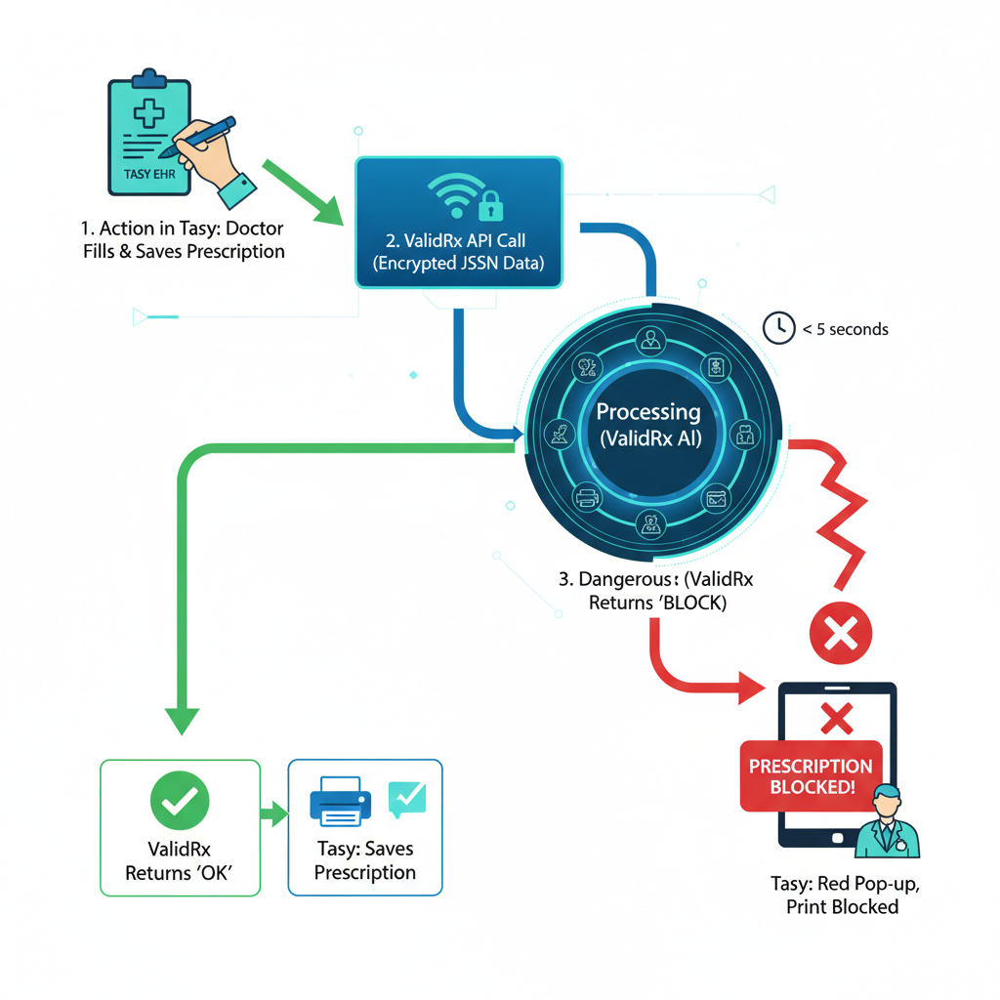
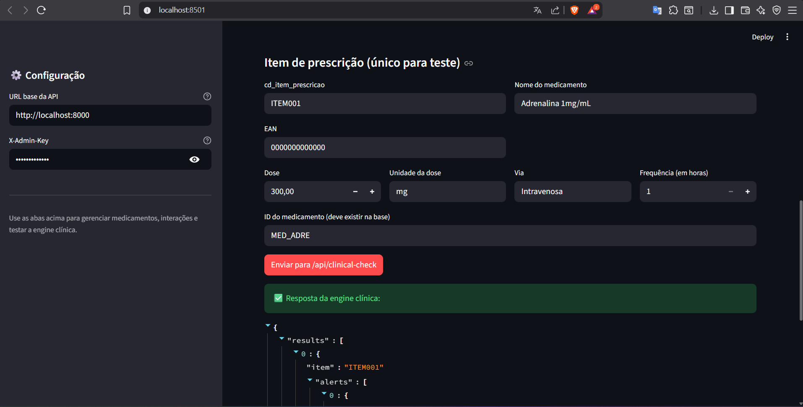

<div align="center">
  
   
  ### Sistema de Inteligência e Supervisão Clínica Automatizada

  Transformando sistemas passivos em guardiões ativos da vida.

  
  
  
  
  
</div>

---

# 📑 Índice

- [🏥 O Problema & A Missão](#-o-problema--a-missão)
- [🤖 O que é o ValidRX?](#-o-que-e-o-ValidRX)
- [🔄 Arquitetura de Integração](#-arquitetura-de-integração-tasymv--validrx)
- [🛡️ As 7 Camadas de Blindagem](#️-as-7-camadas-de-blindagem)
- [⚡ Como Rodar o Projeto](#-como-rodar-o-projeto)
- [📚 Guia de Uso da API](#-guia-de-uso-da-api-exemplos-práticos)
  - [1. Cadastro de Medicamento](#1-cadastrando-um-medicamento-e-regras-admin)
  - [2. Cadastro de Interação Medicamentosa](#2-cadastrando-uma-interação-medicamentosa-admin)
  - [3. Validação de Prescrição Tasy](#3-validando-uma-prescrição-integração-tasy)
  - [4. Validação de Prescrição MV](#4-validando-uma-prescrição-sistema-MV)
- [🤝 Como Contribuir](#-como-contribuir)
- [⚖️ Disclaimer Legal](#️-disclaimer-aviso-legal)

---

## 📰 Novidades & Atualizações

### [DEZ/2025] 📺 Apresentação Oficial: ValidRx em Ação
Saiu o vídeo de apresentação técnica e conceitual do projeto no canal **Prof. Fabio Santos**!
*   **Demo Completa:** Veja o sistema bloqueando o erro fatal da Adrenalina em tempo real.
*   **Bastidores:** A arquitetura da API, a integração com Docker e como a lógica determinística funciona.
*   **A Missão:** Entenda profundamente a motivação por trás do código.
*   👉 **[Assista ao vídeo no YouTube](https://youtu.be/pov63geYlkk)**

### [DEZ/2025] 📘 Nova Documentação de Arquitetura (Motor Lógico)
Publicamos o guia técnico **[DOCS_IA_MOTOR.md](docs/DOCS_IA_MOTOR.md)**, essencial para novos voluntários (Devs e Profissionais de Saúde).
*   **Abertura da "Caixa Preta":** Explicação detalhada de como o ValidRx implementa sua **Árvore de Decisão Determinística**, separando totalmente a Lógica (Python) do Conhecimento (Banco de Dados).
*   **Trace de Execução:** Um passo a passo visual do que acontece no milissegundo em que uma prescrição chega à API (usando o caso real da Adrenalina).
*   **Guia de Contribuição:** Entenda onde mexer no código para criar novos "Nós de Decisão" e como os dados persistem no PostgreSQL.

### [DEZ/2025] 🆕 Suporte Nativo ao Sistema MV (Soul)
O ValidRx agora é oficialmente compatível com os padrões de dados do sistema **MV**, líder na rede pública.
*   **Dicionário de Tradução Inteligente:** Implementamos uma camada de normalização na API (`ROUTE_MAPPING`) que atua como um tradutor em tempo real.
*   **Interoperabilidade Total:** O sistema agora aceita e unifica automaticamente diferentes "dialetos" hospitalares:
    *   **Padrão Tasy:** Aceita termos descritivos (ex: `Endovenosa`, `Oral`).
    *   **Padrão MV:** Aceita siglas e mnemônicos (ex: `EV`, `VO`, `SC`, `IM`).
Isso garante que o ValidRx funcione simultaneamente em ambientes híbridos sem necessidade de reconfiguração do código.

---
# 🏥 O Problema & A Missão

Erros de **dosagem pediátrica**, administração por **via incorreta** ou **superdosagem** estão entre as principais causas de eventos adversos graves.
Os sistemas de prontuário eletrônico (Tasy, MV, Soul) são **passivos**: aceitam o que o usuário digita sem validação clínica profunda. O **ValidRx** muda isso: Ele é uma **IA de decisão clínica** que intercepta prescrições de risco via API **antes que a receita chegue à enfermagem**.

🎯 **Objetivo:** Criar um padrão nacional de segurança aberto para o SUS e iniciativa privada interessada.

---

# 🤖 O que é o ValidRX?

O **ValidRx** é uma IA de validação em tempo real que se conecta ao Prontuário Eletrônico. Ele audita a prescrição médica antes que ela seja liberada para a farmácia ou  enfermagem. É um tipo de sistema de IA denominado de Sistema Especialista. Ele não "aprende sozinho" (**Machine Learning**) e nem "chuta" respostas baseadas em probabilidade (como o **ChatGPT**).  

Ele opera baseado em uma **árvore de decisão determinística, baseada em regras clínicas validadas**. Ele codifica o conhecimento de especialistas humanos (médicos/farmacêuticos) em regras computacionais rigorosas.

## 🧠 O Motor de Inteligência: IA Simbólica

O ValidRx não utiliza "caixas pretas" ou modelos probabilísticos que podem alucinar. O sistema opera baseado em uma **Árvore de Decisão Determinística**, classificada tecnicamente como um **Sistema Especialista Baseado em Regras (Rule-Based Expert System)**.

### Como funciona o raciocínio?
O motor codifica o conhecimento clínico validado (protocolos médicos e farmacêuticos) em regras computacionais rigorosas. Para qualquer entrada de dados, o sistema segue um fluxo lógico auditável:

1.  **Determinismo Puro:**
    Ao contrário de IAs generativas, o ValidRx **não trabalha com probabilidades**. Se a regra define um teto de segurança, o sistema aplicará esse teto 100% das vezes. A mesma entrada sempre gerará a mesma saída, garantindo previsibilidade jurídica e clínica.

2.  **Lógica Computacional Rigorosa (IF / THEN):**
    O "cérebro" do sistema processa prescrições através de operadores lógicos booleanos. O exemplo abaixo ilustra o processamento interno de uma regra de segurança pediátrica:

    > *"**SE** o peso do paciente for menor que 10kg **E** a dose prescrita for maior que 50mg, **ENTÃO** execute o Bloqueio."*

    ```mermaid
    graph LR
    A[Entrada de Dados] --> B{Peso < 10kg?}
    B -- Sim --> C{Dose > 50mg?}
    B -- Não --> D[Aprovar]
    C -- Sim --> E[⛔ BLOQUEAR]
    C -- Não --> D
    ```

3.  **Conhecimento Especializado Codificado:**
    O sistema atua como um "auditor sênior digital". Ele não aprende sozinho; ele é ensinado por especialistas humanos através do Painel Administrativo, transformando diretrizes da ANVISA e protocolos hospitalares em código executável.

---

# 🔄 Arquitetura de Integração (Tasy + ValidRx)

O ValidRx roda **no backend**, integrado ao fluxo do hospital, sem alterar a rotina do médico.

**Intregação com Sistemas Hospitalares**
O ValidRx oferece integração nativa com sistemas hospitalares, como o **Philips Tasy** (https://www.philips.com.br/healthcare/resources/landing/solucao-tasy), através de uma API REST robusta e pronta para uso.
Para garantir uma implementação ágil e sem fricção, nossos endpoints consomem payloads JSON estruturados rigorosamente conforme o padrão de dados do Tasy. Isso permite uma conexão plug-and-play, onde o ValidRx valida prescrições em tempo real aproveitando a estrutura de dados que o seu prontuário já gera.



### Fluxo:

1. Médico clica em **Salvar** no prontuário.  
2. O ValidRx recebe dados criptografados e aplica todas as regras clínicas.  
3. Se houver risco fatal → retorna **BLOCKED** impedindo o procedimento.  
4. Caso contrário → **APPROVED**.

---

# 🛡️ As 7 Camadas de Blindagem

O sistema valida cada item da prescrição passando por 7 níveis:

1. **🧪 Dose Pediátrica (mg/kg)**  
2. **🛑 Teto Absoluto**  
3. **💉 Via de Administração**  
4. **⚠️ Interações Medicamentosas**  
5. **🤧 Alergias**  
6. **🚫 Contraindicações (CID)**  
7. **🔁 Duplicidade Terapêutica**

---

## 🏆 Conformidade com Padrões Internacionais (ISMP)

O **ValidRx** foi arquitetado seguindo rigorosamente as diretrizes do **[Institute for Safe Medication Practices (ISMP)](https://www.ismp.org/)**, a autoridade global independente em segurança medicamentosa.

As "7 Camadas de Blindagem" do sistema cobrem os vetores de erro mais críticos identificados pela instituição. Abaixo, detalhamos o mapeamento entre a recomendação clínica e a implementação técnica:

### 👶 A. Dose Pediátrica e Peso (Camadas 1 e 2)
*   **Recomendação ISMP:** Uso obrigatório de checagem de dose baseada em peso (`mg/kg`) para pacientes pediátricos e estabelecimento de limites de dose máxima (*Max Dose Limits*).
*   **Implementação ValidRx:** O sistema aplica lógica dupla de validação:
    1.  **Dose Ponderal:** Valida o cálculo `mg/kg`.
    2.  **Teto Absoluto (`teto_dose`):** Uma barreira final vital para evitar erros de cálculo em crianças obesas ou erros de casa decimal (ex: digitar 10.0mg em vez de 1.0mg).

### 🛣️ B. Via de Administração (Camada 3)
*   **Recomendação ISMP:** Prevenção de erros de "Via Trocada" (*Wrong Route*), frequentemente fatais (ex: Vincristina intratecal ou Adrenalina IV indevida).
*   **Implementação ValidRx:** Utilizamos a abordagem de **Whitelist (Lista Branca)**, tecnicamente superior à *Blacklist*:
    *   ❌ **Blacklist (Inseguro):** "Não permita Oral". (Se o médico digitar 'Nasal', o erro passa).
    *   ✅ **Whitelist (ValidRx):** "Só aceite IV ou IM". (Qualquer outra entrada é bloqueada imediatamente).

### 🚨 C. Medicamentos de Alta Vigilância (High-Alert Medications)
*   **Recomendação ISMP:** Implementação de *"Hard Stops"* (Bloqueios Rígidos) quando limites de segurança de medicamentos perigosos são excedidos.
*   **Implementação ValidRx:** O sistema diferencia avisos de bloqueios. Para erros críticos (como superdosagem de Adrenalina), o retorno é `status: "BLOCKED"`.
    *   *Por que isso importa?* Alertas amarelos constantes causam "Fadiga de Alertas" e são ignorados. **Bloqueios salvam vidas.**

### 🔄 D. Interoperabilidade e Contexto
*   **Recomendação ISMP:** Padronização de terminologias para evitar ambiguidades.
*   **Implementação ValidRx:** O sistema possui uma camada de tradução de "dialetos" hospitalares (ex: Tasy vs. MV). Isso mitiga erros de interpretação de siglas (ex: `EV` vs `IV`), garantindo que a validação ocorra sobre dados normalizados e seguros.

---

# ⚡ Como Rodar o Projeto

## Pré-requisitos
- Docker Desktop 
- Docker Compose  

## Passo a passo

### 1. Clonar repositório
```bash
https://github.com/prof-fabiosantos/ValidRx_Project.git
cd ValidRx_Project
```
### 2. Iniciar ambiente Docker

Na primeira vez ou quando houver alguma alteração no código use:
``` bash
docker-compose up --build
```
Se não houver nenhuma alteração no código use:
```bash
docker compose up
```

A API e o banco PostgreSQL serão iniciados automaticamente.

### 3. Abrir Swagger

Acesse:

    http://localhost:8000/docs

------------------------------------------------------------------------

# 📚 Guia de Uso da API (Exemplos Práticos)

A API segue o padrão REST.

------------------------------------------------------------------------

🔐 Autenticação Admin

Todos os endpoints administrativos exigem:
x-admin-key: ADMIN_SECRET_KEY

A chave é configurada no .env:
ADMIN_SECRET_KEY=MEUSEGREDO123

------------------------------------------------------------------------

## 1. Cadastrando um Medicamento e Regras (Admin)

**Endpoint:**

    POST /api/admin/drugs

**Header obrigatório:**

    x-admin-key: MEUSEGREDO123

📌 Exemplo --- Cadastrando Adrenalina 1mg/mL e as Regras: Dose Pediátrica e Teto Absoluto,  Via de Administração e Segurança para Adultos

``` json
{
  "id": "ADRE_1MG",
  "nome": "Adrenalina 1mg/mL",
  "principio_ativo": "Epinefrina",
  "classe_terapeutica": "Vasopressor",
  "familias_alergia": [],
  "concentracao_mg_ml": 1,
  "min_idade_meses": 0,
  "dose_max_diaria_adulto_mg": 1,
  "contra_indicacoes": [],
  "vias_permitidas": ["Endovenosa (IV)", "Intramuscular (IM)"],
  "pediatria": {
      "modo": "mg_kg_dose", 
      "min": 0.01,
      "max": 0.01,
      "teto_dose": 0.5
  }
}
```

O cadastro das regras de segurança neste JSON está dividido em 3 campos principais. É a combinação desses campos que diz ao ValidRx o que ele deve permitir ou bloquear.
Aqui está o "Raio-X" de onde está cada regra:

1. A Regra de Dose Pediátrica e Teto Absoluto:
Aqui está a inteligência matemática que evita a sobredose (o caso da criança de 6 anos).

```jsonc
"pediatria": {
    "modo": "mg_kg_dose",  // Diz para calcular por dose unitária, não por dia
    "min": 0.01,           // Dose mínima eficaz: 0.01 mg/kg
    "max": 0.01,           // Dose máxima padrão: 0.01 mg/kg
    "teto_dose": 0.5       // <--- AQUI ESTÁ O "FREIO DE EMERGÊNCIA"
}
```

2. A Regra de Via de Administração:
Aqui está a lista branca (whitelist). Se o médico tentar usar uma via que não está escrita aqui, o sistema bloqueia.

``` json
"vias_permitidas": ["Endovenosa (IV)", "Intramuscular (IM)"]
```
O que essa regra diz ao sistema: "Só aceite se a via for IV ou IM. Se vier 'Oral', 'Subcutânea' ou qualquer outra coisa, BLOQUEIE."
Nota: No seu código do motor de IA (engine.py), existe uma regra extra hardcoded (escrita no código) específica para a Adrenalina IV que exige "Parada Cardíaca", funcionando como uma camada adicional a esta lista.

3. A Regra de Segurança para Adultos:
Embora o foco seja pediatria, esta linha protege adultos (ou crianças maiores que 12 anos no seu sistema atual).

``` json
"dose_max_diaria_adulto_mg": 1
``` 
O que essa regra diz ao sistema: "Se o paciente for adulto, a soma de todas as doses do dia não pode passar de 1mg."

------------------------------------------------------------------------

## 2. Cadastrando uma Interação Medicamentosa (Admin)

**Endpoint:**

    POST /api/admin/interactions

📌 Exemplo ---  Varfarina + Ibuprofeno

``` json
{
  "substancia_a": "varfarina",
  "substancia_b": "ibuprofeno",
  "nivel": "ALTO",
  "mensagem": "🔴 RISCO HEMORRÁGICO: AINEs aumentam o efeito da Varfarina."
}
```
Este JSON representa o cadastro de uma regra de Interação Medicamentosa no sistema ValidRx. Ele serve para "ensinar" ao sistema que duas substâncias específicas não devem ser administradas juntas devido a um risco clínico.  

Aqui está o detalhamento de cada campo:
- **substancia_a** e **substancia_b**: Identificam os dois princípios ativos que geram o conflito. Neste exemplo, são a Varfarina (anticoagulante) e o Ibuprofeno (anti-inflamatório).
- **nivel**: Define a gravidade da interação. O valor "ALTO" indica que o sistema deve tratar isso como um risco severo (geralmente resultando em um bloqueio ou alerta vermelho para o médico).
- **mensagem**: É o texto explicativo que aparecerá na tela do profissional de saúde. Ele justifica o alerta: "🔴 RISCO HEMORRÁGICO: AINEs aumentam o efeito da Varfarina."  

Quando o **ValidRx** encontra esses dois medicamentos prescritos para o mesmo paciente, ele consulta essa regra e dispara o alerta definido no JSON.

------------------------------------------------------------------------

## 3. Validando uma Prescrição (Integração Tasy)

**Endpoint principal do sistema hospitalar:**

    POST /api/clinical-check

### Cenário demonstrativo

📌 Exemplo de prescrição para validação
*Criança de 20kg, 3ml de Adrenalina IV (erro fatal)*

### Payload

``` json
{
  "cd_medico": "CRM-12345",
  "patient": {
    "cd_pessoa_fisica": "PAC-9988",
    "nm_paciente": "João da Silva",
    "nr_atendimento": "AT-100",
    "weight_kg": 20.0,
    "age_months": 72,
    "conditions": ["tosse seca"],
    "allergies": [],
    "current_meds": []
  },
  "items": [
    {
      "cd_item_prescricao": "1",
      "ean_codigo": "789123456001",
      "nm_medicamento": "Adrenalina 1mg/mL",
      "dose_input": 3.0,
      "dose_unidade": "ml",
      "route": "Endovenosa (IV)",
      "freq_hours": 24,
      "drug_id": "ADRE_1MG"
    }
  ]
}

```

### Resposta esperada (BLOQUEIO)

``` json
{
  "status": "BLOCKED",
  "message": "⛔ A prescrição contém erros bloqueantes de segurança.",
  "alerts": [
    {
      "type": "BLOCK",
      "msg": "[Adrenalina 1mg/mL]: ⛔ ERRO FATAL: Adrenalina IV só em PCR."
    },
    {
      "type": "BLOCK",
      "msg": "[Adrenalina 1mg/mL]: ⛔ TETO ABSOLUTO EXCEDIDO: 3.0mg > 0.5mg."
    }
  ]
}
```


## 4. Validando uma Prescrição (Sistema MV)
O ValidRx por ser aberto e implementar uma arquitetura agnóstica ele se adaptar aos padrões de dados do sistema **MV (SOUL)**, líder na rede pública. Abaixo, um exemplo de payload mapeando os campos nativos do MV (Tabelas `PRE_MED`, `ITPRE_MED`) para a nossa API.

**Cenário:** Integração via módulo MDI (MV Data Interchange).

*   **Endpoint:** `POST /api/clinical-check`

**Payload (Simulação MV):**
```jsonc
{
  "cd_medico": "12345", 
  "patient": {
    "cd_pessoa_fisica": "MV-888999",
    "nm_paciente": "ANA CLARA DA SILVA",
    "nr_atendimento": "102030",
    "weight_kg": 20.0,
    "age_months": 72,
    "conditions": ["J00"], 
    "allergies": [],
    "current_meds": []
  },
  "items": [
    {
      "cd_item_prescricao": "1",
      "ean_codigo": "789123456001",
      "nm_medicamento": "ADRENALINA SOL INJ 1MG/ML", 
      "dose_input": 3.0,
      "dose_unidade": "AMP",
      "route": "EV", 
      "freq_hours": 24,
      "drug_id": "MED_ADRE"
    }
  ]
}
 
```

------------------------------------------------------------------------

🖥️ Painel Administrativo (App em Streamlit)

O ValidRx agora inclui um Painel Administrativo desenvolvido em Streamlit, projetado para facilitar a gestão completa do sistema sem necessidade de acessar o banco de dados manualmente ou manipular arquivos diretamente.



Esse painel fornece uma interface simples, visual e organizada para administradores atualizarem informações críticas de forma segura.

✨ Principais Funcionalidades:

- Gerenciamento de Medicamentos
  - Listar todos os medicamentos cadastrados
  - Adicionar novos medicamentos
  - Editar informações existentes
  - Excluir entradas incorretas ou desatualizadas

- Visualização das Regras de Validação
- Acessar as regras armazenadas no motor de validação

🔐 Acesso Restrito ao Administrador

Todas as operações do painel são protegidas por autenticação básica.
Somente usuários autorizados (admin) podem visualizar e modificar os dados.


🚀 Como Executar o Painel

1. No mesmo projeto (acesse diretório app):
```bash
python -m venv venv
.\venv\Scripts\activate   
pip install streamlit requests
 ```
Garante que streamlit e requests estejam instalados (ou adicionados ao seu requirements.txt).

2. Com a API rodando (Docker validrx-api + validrx-db funcionando), execute:
```bash
  .\venv\Scripts\activate
  streamlit run validrx_admin_app
```

📌 Observação

O painel funciona integrado com a API FastAPI e depende do PostgreSQL configurado no Docker Compose.
Ele é a maneira recomendada de manter o ValidRx sempre atualizado, seguro e alinhado à prática clínica.

------------------------------------------------------------------------

# 🤝 Como Contribuir

O **ValidRx** é um projeto Open Source cuja missão é **proteger vidas**. Sua
colaboração é valiosa.

## 👩‍💻 Para Desenvolvedores (Tech)

O **ValidRx** é um projeto vivo e precisamos de ajuda em diversas frentes para torná-lo o padrão de segurança do SUS. Escolha sua área de expertise e junte-se a nós:

- 🔌 Interoperabilidade & Padrões: Criação de adaptadores para HL7 FHIR e TISS/TUSS, permitindo que o **ValidRx** "converse" nativamente com grandes prontuários (Epic, Tasy, MV).
- 🗄️ Engenharia de Dados (ETL): Desenvolvimento de scrapers e scripts para atualizar automaticamente a base de medicamentos com dados da ANVISA/CMED e mapeamento de códigos EAN/GTIN.
- ⚡ Performance & DevOps: Implementação de cache (Redis) para validações de alta frequência, testes de carga e anonimização de logs para conformidade total com a LGPD.
- 🎨 Frontend (Backoffice): Evolução do painel administrativo (atualmente em Streamlit) para interfaces mais robustas (React/Vue.js), facilitando a gestão de regras por farmacêuticos.
- 🧪 QA & Testes Clínicos: Criação de testes unitários e cenários de "pacientes virtuais" (CI/CD) para garantir que novas regras não quebrem a lógica de segurança crítica.

📌 Como ajudar:
**Fork → Branch → Pull Request**

------------------------------------------------------------------------

## 👨‍⚕️ Para Profissionais de Saúde (Curadoria)

Os farmacêuticos e médicos desempenham um papel essencial no aprimoramento do **ValidRx**. Eles ajudam a garantir que o sistema seja seguro, confiável e alinhado à prática clínica real. Entre as principais formas de contribuição:

- **Revisão clínica das regras**:
  atualizam contraindicações, doses, interações e diretrizes conforme a prática médica.

- **Curadoria da base de medicamentos**:
  adicionam, corrigem e validam informações essenciais sobre tratamentos.

- **Validação de respostas**:
  avaliam as classificações de risco e justificativas geradas pela IA.

- **Testes em cenários clínicos simulados**:
  adentificam falsos positivos/negativos e possíveis riscos não previstos.

- **Criação de casos para treinamento**:
  fornecem prescrições corretas/incorretas e explicações clínicas estruturadas.

- **Auditoria de segurança e ética**:
  ajudam a detectar recomendações inseguras ou inconsistências do motor de validação.

- **Feedback contínuo**:
  reportam melhorias necessárias diretamente baseadas na prática.

A colaboração médica garante que o ValidRx evolua de forma responsável, com alto rigor clínico e foco em segurança ao paciente.

------------------------------------------------------------------------

# 💬  Discord

https://discord.gg/HkFJFCt2

------------------------------------------------------------------------

## 📄 Licença e Direitos Autorais

Este projeto é distribuído sob a licença **Apache License 2.0**.

Isso concede a liberdade para usar, modificar e distribuir este software (em hospitais públicos e privados), **desde que as condições de atribuição sejam rigorosamente respeitadas**.

### ⚠️ Condição Mandatória de Uso
O conceito, arquitetura e código original foram desenvolvidos por **Prof. Fábio Santos**.

Para estar em conformidade com a licença, qualquer redistribuição, cópia ou trabalho derivado deste software **DEVE**:
1.  Manter o arquivo `LICENSE` original.
2.  **Manter intacto o arquivo `NOTICE`**, que contém os créditos devidos ao autor original e aos contribuidores do projeto.

A remoção ou ocultação dos créditos de autoria constitui violação direta dos termos de uso. O objetivo deste projeto é salvar vidas através da colaboração, e o reconhecimento da autoria é a base dessa confiança.

------------------------------------------------------------------------

# ⚖️ Disclaimer (Aviso Legal)
O ValidRx é um CDSS — ferramenta de apoio à decisão clínica.

Não substitui julgamento clínico.
Responsabilidade final da prescrição é do médico.
Recomenda-se revisão contínua das regras pela farmácia clínica.


